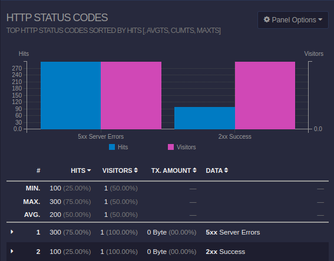

# Nginx Proxy Analysis

Small research project aimed at understanding failure modes of nginx and reverse proxy buffering. 

### Thesis

By understanding various socket conditions on an upstream proxy we can predict the state and resource consumption of an nginx process. 

### Prompt

What is the default failure mode of nginx reverse proxy when a Unix domain socket is in various states? What other socket conditions have an impact on nginx failures?

At what point does the resource consumption of nginx becoming significant due to upstream socket conditions?

### Environment

```bash
nginx/1.22.1
Linux 6.1.12-arch1-1
```

### Setting up

Ensure the following dependencies are on the current filesystem:

 - `goaccess`
 - `nginx` (complete with stub_status and http_status modules)

Run the dashboard

```bash
./dashboard
```

Run the proxy

```bash
./proxy
```

and open the `report.html` file dashboard in your local browser.

# Findings

The Unix socket states are indicative of internal sockets opened up via a single socket file on the filesystem. There are subject to be multiple socket instances per socket file. File descriptors exist for every connection where the upstream server calls `accept()`.

In the event that the upstream server "does not return a valid HTTP response and close the file descriptor for the connection, Nginx returns a 5XX level internal server error.



### Nginx Metrics

The **Active Connections** metric from the [nginx stub status module](https://nginx.org/en/docs/http/ngx_http_stub_status_module.html) is an accurate indicator of which client connections are currently waiting on the upstream server.

In order to demonstrate the "buffered" requests perform the following steps:
 
 1. Start an nginx reverse proxy `./proxy`
 2. Start a bad upstream server `./src/upstream-server-not-accept`
 3. Send requests to the proxy server `curl localhost:80 &`
 4. Read the output of the status module `curl localhost:80/stats`

See that the number of **Active Connections** represents the number of requests which are currently "hanging" and waiting for the upstream server to call `accept()` plus 1.

Eventually all curl requests to the proxy server will return **504 Gateway Timeout**.

### Nginx and `net.core.somaxconn`

The amount of **Active Connections** returned by the stub status will not be limited by the `somaxconn` kernel parameter as the **Active Connections** will take upstream connections into consideration. The `somaxconn` kernel value only impacts the nginx proxy server calling `listen()` for new clients.

First set `net.core.somaxconn` to a small number.

```bash 
sudo -E sysctl -w net.core.somaxconn=8
```
Next start the proxy and a bad upstream server.

```bash 
./proxy
./src/upstream-server-not-accept
```

Send a large number of requests to the proxy, greater than the value set in the step above

```bash 
curl -X POST -d /tmp/payload.dat localhost:80 &
```

Check **Active Connections**

```bash 
curl localhost:80/stats
Active connections: 27 
server accepts handled requests
 114 114 114 
Reading: 0 Writing: 27 Waiting: 0 
```

The `somaxconn` kernel configuration only impacts the `listen()` function as expressed in the [Kernel 6.2 user API implementation](https://github.com/torvalds/linux/blob/master/net/socket.c#L1824-L1843) and defined in the code:

```c 
/* Prepare to accept connections on socket FD.
   N connection requests will be queued before further requests are refused.
   Returns 0 on success, -1 for errors.  */
extern int listen (int __fd, int __n) __THROW;
```
Requests against a server calling `listen()` will be queued before eventually refused based on the value passed to the listen function.

According to [a popular nginx tuning guide](https://www.nginx.com/blog/tuning-nginx/) the `somaxconn` is used to configure:

> The maximum number of connections that can be queued for acceptance by NGINX

This research shows that nginx will first call `listen()` with `SOMAXCONN` and `accept()` connections regardless of the state of the upstream server.

In the event the upstream server is not calling `accept()` on a given request nginx will queue the request and eventually refuse a connection as the `SOMAXCONN` threshold is crossed.

The value that `SOMAXCONN` is set to can be reasoned as the effective `accept()` queue for a given nginx `proxy_pass` directive.


### Nginx memory consumption

Initial research shows that nginx will not allocate memory in the event that a request is queued in the `listen()` queue while waiting on an upstream server.

First create a large file to serve as a bogus payload

```bash 
# Create a ~17 Mb file
dd if=/dev/urandom of=/tmp/payload.dat  bs=1M  count=16
```

Next start the nginx proxy, and a known faulty upstream server.

```bash 
./proxy
./src/upstream-server-not-accept
```

Next send large amounts of bogus POST requests to the server with the large payload.

```bash
curl -X POST -d /tmp/payload.dat localhost:80 &
```

Memory consumption of the main nginx process, and subsequent nested worker processes remains constant.


- See [ngx_palloc.c](https://github.com/nginx/nginx/blob/master/src/core/ngx_palloc.c) for implementation detail

Additionally `strace` the proxy server:

```bash 
nginx \
  -c $(pwd)/etc/nginx.conf &
strace -f -p $!
```

and view the output for a given single post request

```
[{events=EPOLLIN, data={u32=145702928, u64=139848575827984}}], 512, 60000) = 1
[pid 301051] accept4(5, {sa_family=AF_INET, sin_port=htons(49960), sin_addr=inet_addr("127.0.0.1")}, [112 => 16], SOCK_NONBLOCK) = 12
[pid 301051] epoll_ctl(8, EPOLL_CTL_ADD, 12, {events=EPOLLIN|EPOLLRDHUP|EPOLLET, data={u32=145703888, u64=139848575828944}}) = 0
[pid 301051] epoll_wait(8, [{events=EPOLLIN, data={u32=145703888, u64=139848575828944}}], 512, 55619) = 1
[pid 301051] recvfrom(12, "POST / HTTP/1.1\r\nHost: localhost"..., 1024, 0, NULL, NULL) = 163
[pid 301051] epoll_ctl(8, EPOLL_CTL_MOD, 12, {events=EPOLLIN|EPOLLOUT|EPOLLRDHUP|EPOLLET, data={u32=145703888, u64=139848575828944}}) = 0
[pid 301051] socket(AF_UNIX, SOCK_STREAM, 0) = 13
[pid 301051] ioctl(13, FIONBIO, [1])    = 0
[pid 301051] epoll_ctl(8, EPOLL_CTL_ADD, 13, {events=EPOLLIN|EPOLLOUT|EPOLLRDHUP|EPOLLET, data={u32=145704128, u64=139848575829184}}) = 0
[pid 301051] connect(13, {sa_family=AF_UNIX, sun_path="/var/run/nginx-proxy-analysis.sock"}, 110) = 0
[pid 301051] getsockopt(13, SOL_SOCKET, SO_ERROR, [0], [4]) = 0
[pid 301051] writev(13, [{iov_base="POST / HTTP/1.0\r\nHost: case-upst"..., iov_len=170}, {iov_base="/tmp/payload.dat", iov_len=16}], 2) = 186
[pid 301051] epoll_wait(8, [{events=EPOLLOUT, data={u32=145703888, u64=139848575828944}}, {events=EPOLLOUT, data={u32=145704128, u64=139848575829184}}], 512, 55618) = 2
[pid 301051] epoll_wait(8,
```

### Nginx Proxy Behavior 

Nginx will call `listen()` with `SOMAXCONN` for every instance of `proxy_pass` defined in a configuration.

For every client request, Nginx can be expected to perform the following:

 - Call `accept()` on the proxy socket connection for each client
 - Call `connect()` against the upstream server (synchronous)
 - Call `write()` against the upstream server (if upstream calls `read()`)
 - Call `epoll_wait()` against the file descriptor (wait for upstream)
 - Call `close()` against the upstream socket as soon as the upstream returns, or the request times out
   - In the event a 5XX is returned due to a faulty upstream, nginx will call `write()` against the client socket to return the 504 Gateway Timeout

# Test Cases and Observations

### Case 1: Upstream server always returns HTTP 200 

In the case where the upstream server works as expected (happy path) we call `accept()`, and `read()` and `write()` and `close(newsockfd)` and spoof a successful HTTP 200 for every request here are the findings:

 - Single lines in the `/proc/net/unix` file indicating that a single Unix socket operates behind the socket file. This is to be expected as we call `close()` for each connection.
 - The socket state saturation from the `/proc/net/unix` file is the vast majority (90% or higher) in state `01` **SS_UNCONNECTED**.
 - Nginx will work as expected and proxy requests to/from the upstream server.

### Case 2: Upstream server not accepting connections

In the case where the upstream server does not call the C function `accept()` after a socket has been established here are the findings:

 - Multiple lines in the `/proc/net/unix` file indicating multiple Unix sockets opened on the same socket file.
 - The socket state saturation from the `/proc/net/unix` file is the vast majority (90% or higher) in state `02` **SS_CONNECTING** with the minority in state `01` **SS_UNCONNECTED**.
 - Nginx will "hang" and `curl` clients wait for a connection to be established, `curl` clients are synchronously hanging until timeout.

### Case 3: Upstream server accepts new connections, but does not read

In the case where the upstream server does call the C function `accept()` but never calls `read()` or  `write()` on the connection, nor `close()` on the file descriptor here are the findings:

- Multiple lines in the `/proc/net/unix` file indicating multiple Unix sockets opened on the same socket file.
- The socket state saturation from the `/proc/net/unix` file is the vast majority (90% or higher) in state `03` **SS_CONNECTED** with the minority in state `01` **SS_UNCONNECTED**.
- Nginx will "hang" and `curl` clients wait for a response from the server, `curl` clients are synchronously hanging until timeout.

### Case 4: Upstream server accepts new connections, reads, but does not write

In the case where the upstream server calls the C functions `accept()` and `read()` but never calls `write()` on the connection, nor `close()` on the file descriptor here are the findings:

- Multiple lines in the `/proc/net/unix` file indicating multiple Unix sockets opened on the same socket file.
- The socket state saturation from the `/proc/net/unix` file is the vast majority (90% or higher) in state `03` **SS_CONNECTED** with the minority in state `01` **SS_UNCONNECTED**.
- Nginx will "hang" and `curl` clients wait for a response from the server, `curl` clients are synchronously hanging until timeout.

Note: The output of the test indicates there is a small latency between when the socket state switches from `03` **SS_CONNECTED** to `01` **SS_UNCONNECTED** that increases in this test case when compared to case 3. During the duration between socket states, there is a sample where there is only a single line in the `/proc/net/unix` file. Presumably this occurs when the `curl` client timeouts.

### Case 5: Upstream server accepts new connections, reads, writes but does not close

In the case where the upstream server calls the C functions `accept()`, `read()`, `write()` on the connection but never calls `close()` on the file descriptor here are the findings:

- Multiple lines in the `/proc/net/unix` file indicating multiple Unix sockets opened on the same socket file.
- The socket state saturation from the `/proc/net/unix` file is the vast majority (90% or higher) in state `03` **SS_CONNECTED** with the minority in state `01` **SS_UNCONNECTED**.
- Nginx will "hang" and `curl` clients wait for a response from the server, `curl` clients are synchronously hanging until timeout.

Note: The output of the test indicates there is an even larger latency between when the socket state switches from `03` **SS_CONNECTED** to `01` **SS_UNCONNECTED** that increases again in this test case when compared to cases 3 and 4. During the duration between socket states, there is a sample where there is only a single line in the `/proc/net/unix` file. Presumably this occurs when the `curl` client timeouts.

### Resources

 - [Manual for /proc/net/unix](https://man7.org/linux/man-pages/man5/proc.5.html)
 - [Linux 6.2 Create Unix Socket](https://github.com/torvalds/linux/blob/v6.2/net/unix/af_unix.c#L995)

```c 
// Kernel Linux 6.2
// Taken from https://github.com/torvalds/linux/blob/v6.2/include/uapi/linux/net.h
typedef enum {
	SS_FREE = 0,			/* not allocated		*/
	SS_UNCONNECTED,			/* unconnected to any socket	*/
	SS_CONNECTING,			/* in process of connecting	*/
	SS_CONNECTED,			/* connected to socket		*/
	SS_DISCONNECTING		/* in process of disconnecting	*/
} socket_state;
```

| Enum             | Value | Sample (/proc/net/unix) |
|------------------|-------|-------------------------|
| SS_FREE          | 0     | 00                      |
| SS_UNCONNECTED   | 1     | 01                      |
| SS_CONNECTING    | 2     | 02                      |
| SS_CONNECTED     | 3     | 03                      |
| SS_DISCONNECTING | 4     | 04                      |

